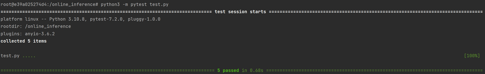
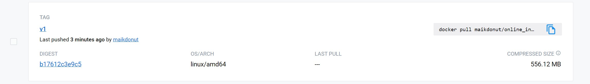
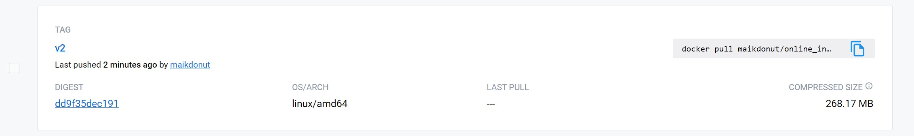

# Homework №2

### __To build docker image__
- from online_inference
```  
docker build -t maikdonut/online_inference:v2 .
docker tag  maikdonut/online_inference:v2 maikdonut/online_inference:v2
```
- from DockerHub: https://hub.docker.com/r/maikdonut/online_inference/tags
```  
docker pull maikdonut/online_inference:v2
```
### __To run docker container__
```
docker run -d -p 8000:8000 maikdonut/online_inference:v2
```
### __To run request__
```
python request.py
```
### __To run tests__
```
docker exec -it <CONTAINER_NAME> bash
python3 -m pytest test.py
```
### __Test results__

### __Docker image size optimizations__
Initial size was 556 MB

After using python:3.10-slim size became 268 MB



